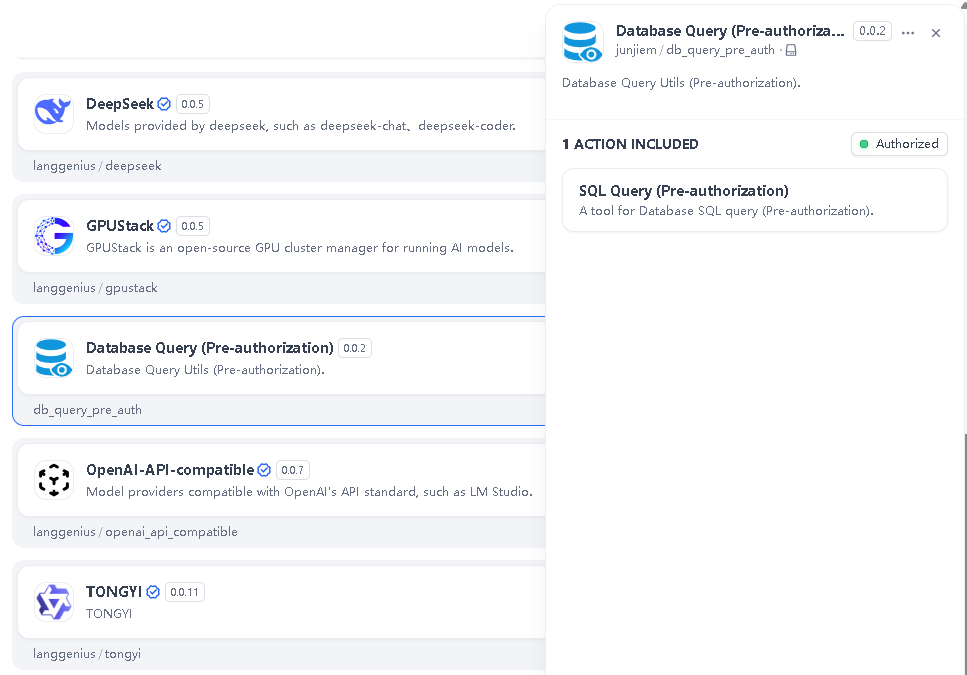
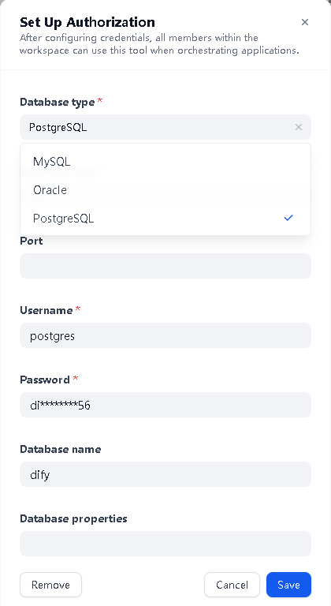
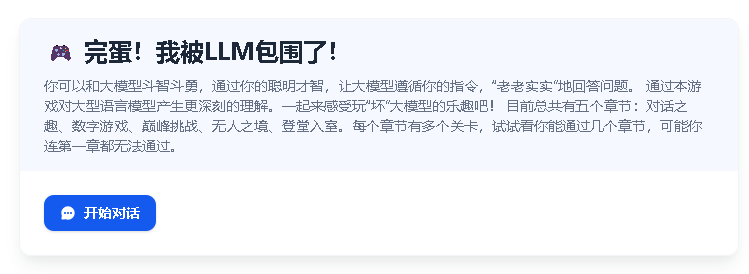
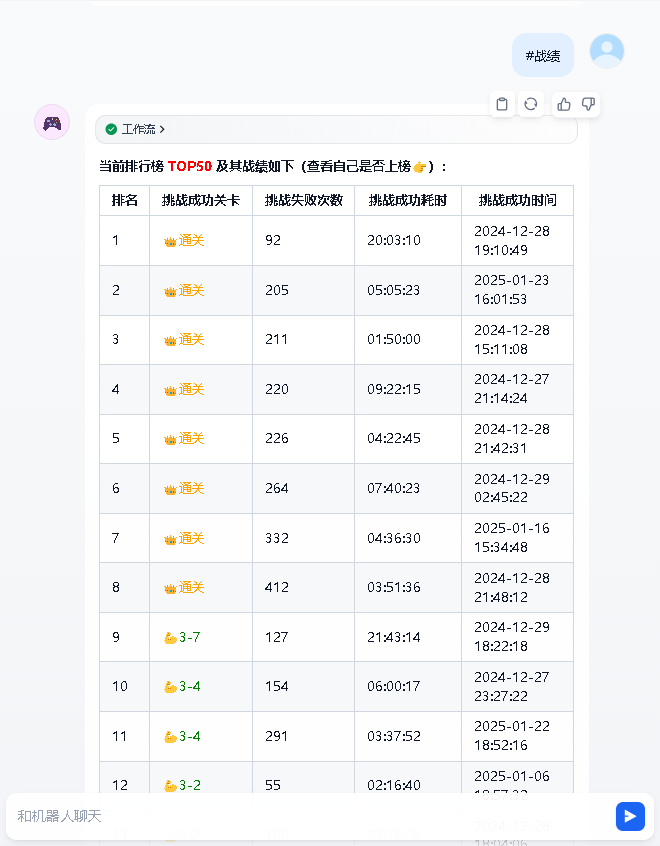

## Dify 1.0 Plugin Database Query Tools (Pre-authorization)


**Author:** [Junjie.M](https://github.com/junjiem)   
**Type:** tool  
**Github Repo:** [https://github.com/junjiem/dify-plugin-tools-dbquery](https://github.com/junjiem/dify-plugin-tools-dbquery)  
**Github Issues:** [issues](https://github.com/junjiem/dify-plugin-tools-dbquery/issues)


---


### Demonstration

Database Query Tools (Pre-authorization)

数据库查询工具（预授权）

Currently supported database types: mysql, oracle, [oracle11g](#2-how-to-connect-to-oracle-11g--如何连接oracle-11g), postgresql, mssql, or [dm (DaMeng)](#3-how-to-connect-to-dm-dameng-database--如何连接达梦数据库).

目前支持的数据库类型：mysql、oracle、[oracle11g](#2-how-to-connect-to-oracle-11g--如何连接oracle-11g)、postgresql、mssql、[dm（达梦）](#3-how-to-connect-to-dm-dameng-database--如何连接达梦数据库)。






---


### Examples 示例

- [完蛋！我被LLM包围了！（Dify1.0战绩排行版）](https://github.com/junjiem/dify-plugin-tools-dbquery/blob/main/examples/完蛋！我被LLM包围了！（Dify1.0战绩排行版）.yml)

- [完蛋！我被LLM包围了！（Dify1.0战绩排行+留言版）](https://github.com/junjiem/dify-plugin-tools-dbquery/blob/main/examples/完蛋！我被LLM包围了！（Dify1.0战绩排行+留言版）.yml)








---


### FAQ

#### 1. How to Handle Errors When Installing Plugins? 安装插件时遇到异常应如何处理？

**Issue**: If you encounter the error message: plugin verification has been enabled, and the plugin you want to install has a bad signature, how to handle the issue?

**Solution**: Add the following line to the end of your .env configuration file: FORCE_VERIFYING_SIGNATURE=false
Once this field is added, the Dify platform will allow the installation of all plugins that are not listed (and thus not verified) in the Dify Marketplace.

**问题描述**：安装插件时遇到异常信息：plugin verification has been enabled, and the plugin you want to install has a bad signature，应该如何处理？

**解决办法**：在 .env 配置文件的末尾添加 FORCE_VERIFYING_SIGNATURE=false 字段即可解决该问题。
添加该字段后，Dify 平台将允许安装所有未在 Dify Marketplace 上架（审核）的插件，可能存在安全隐患。


#### 2. How to connect to oracle 11g  如何连接Oracle 11g

2.1、下载 oracle11g 的 client，这里下的是 11.2.0.4.0 版本

https://www.oracle.com/database/technologies/instant-client/downloads.html

比如：instantclient-basic-linux.x64-11.2.0.4.0.zip


2.2、上传 oracle 的 client 到宿主机的 dify 的挂载目录

将 instantclient-basic-linux.x64-11.2.0.4.0.zip 解压后的 instantclient_11_2 目录放到 docker/volumes 下面
> 注：需要将 `instantclient_11_2` 中`libclntsh.so.11.1` 改成 `libclntsh.so`、 `libocci.so.11.1` 改成 `libocci.so`

2.3、在 `docker/docker-compose.yml` 中进行配置
```
# 在 plugin_daemon 下，添加一个变量
environment:
  ......
  LD_LIBRARY_PATH: "/root/instantclient_11_2:$LD_LIBRARY_PATH"
```

Red Hat 系（如 CentOS、RHEL）64 位：
```
# 在 plugin_daemon 下，添加三个挂载
volumes:
  ......
  - ./volumes/instantclient_11_2:/root/instantclient_11_2
  - /usr/lib64/libaio.so.1.0.1:/usr/lib/x86_64-linux-gnu/libaio.so.1.0.1
  - /usr/lib64/libaio.so.1:/usr/lib/x86_64-linux-gnu/libaio.so.1
```

Debian 系（如 Ubuntu）64 位：
```
# 在 plugin_daemon 下，添加三个挂载
volumes:
  ......
  - ./volumes/instantclient_11_2:/root/instantclient_11_2
  - /usr/lib/x86_64-linux-gnu/libaio.so.1.0.1:/usr/lib/x86_64-linux-gnu/libaio.so.1.0.1
  - /usr/lib/x86_64-linux-gnu/libaio.so.1:/usr/lib/x86_64-linux-gnu/libaio.so.1
```

2.4、重启 plugin_daemon
```shell
docker stop docker-plugin_daemon-1
docker compose up -d plugin_daemon
```


#### 3. How to connect to DM (DaMeng) database  如何连接达梦数据库

Unlike Oracle 11g, DM (DaMeng) works out of the box — no extra host configuration is required. The plugin depends on `dmPython` (which ships prebuilt wheels for Python 3.12 on amd64/arm64) and the official `sqlalchemy_dm_dialect`, so you do **not** need to install any DM client on the host.

与 Oracle 11g 不同，达梦数据库开箱即用，无需任何额外的宿主机配置。插件依赖 `dmPython`（已提供 Python 3.12 的 amd64/arm64 预编译 wheel 包）与官方方言包 `sqlalchemy_dm_dialect`，因此**无需**在宿主机安装任何达梦客户端。

Just fill in the following fields in the pre-authorization (credentials) form / 在预授权（凭据）配置中填写以下字段即可：

- **Database type / 数据库类型**: select `DM (DaMeng)` / 选择 `达梦`
- **Database Host / 数据库地址**: DM server hostname or IP / 达梦服务器主机名或 IP
- **Port / 端口**: DM default port is `5236` / 达梦默认端口为 `5236`
- **Username / 用户名**: e.g. `SYSDBA` / 例如 `SYSDBA`
- **Password / 密码**: your DM password / 达梦密码
- **Database name / 库名**: usually leave empty (DM organizes objects by schema, not by database name) / 通常留空（达梦以模式 schema 组织对象，而非库名）
- **Database properties / 数据库属性**: optional, for example `local_code=1&connection_timeout=15` / 可选，例如 `local_code=1&connection_timeout=15`

The underlying connection URL is `dm+dmPython://<username>:<password>@<host>:<port>/`. When you save the authorization, the plugin runs a `SELECT 1` to verify the connection.

底层连接串为 `dm+dmPython://<用户名>:<密码>@<主机>:<端口>/`。保存授权时，插件会执行一次 `SELECT 1` 来验证连接是否可用。

> Tip: If the password contains special characters, the plugin will URL-encode it automatically, so fill in the original (non-encoded) string.
>
> 提示：若密码包含特殊字符，插件会自动进行 URL 编码，因此请填写原始（未编码）字符串。


#### 4. How to install the offline version 如何安装离线版本

Scripting tool for downloading Dify plugin package from Dify Marketplace and Github and repackaging [true] offline package (contains dependencies, no need to be connected to the Internet).

从Dify市场和Github下载Dify插件包并重新打【真】离线包（包含依赖，不需要再联网）的脚本工具。

Github Repo: https://github.com/junjiem/dify-plugin-repackaging

